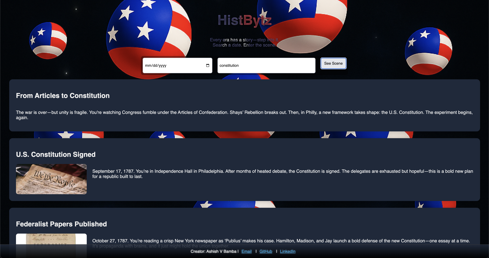
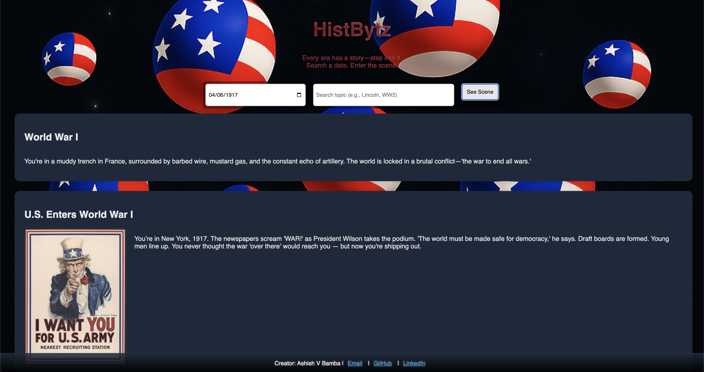

# 🕰️ HistBytz 

**Interactive Timeline Explorer for U.S. History** 


This project is licensed under the [MIT License](./LICENSE) © 2025 Ashish Bamba.

🔗 **Live App:** [HistBytz](https://abamba-histbytz-sdsq.onrender.com/)  

---

## 📌 Overview

**HistBytz** is a full-stack interactive history explorer built with ReactJS + Vite on the frontend and NodeJS + ExpressJS on the backend. Users can search historical events by keyword or date, and the backend dynamically retrieves matching results from a MongoDB-backed NoSQL dataset. 
- 🔤 **Keyword search**: e.g., "civil rights", "World War"
- 📅 **Date search**: e.g., "7/4/1776", "4/09/1865"

The app maps your input to a **relevant historical period** and a **specific U.S. event**, providing clear, concise context.

**IMPORTANT UPDATE**: Our app can now provide intelligent "Did you mean?" suggestions to reroute user's request in case of keyword mistypes in search bar.

---

## 🎯 Core Features

- 🧠 Intelligent "Did you mean?" suggestions powered by Levenshtein's DP-based algorithm
- 📆 Mapped to both general historical era + specific event
- ⚡ Fast, lightweight UI with Vite + React
- 🗄️ Dynamic event retrieval from MongoDB-backed NoSQL dataset via Express API
- 🧭 Educational for students, teachers, and trivia lovers

---

## ⚙️ Tech Stack

| Layer        | Technology         |
|--------------|--------------------|
| **Frontend**     | ReactJS + Vite       |
| **Styling**      | HTML/CSS           |
| **Backend**     | NodeJS + ExpressJS  |
| **Database**     | NoSQL + MongoDB               |
| **Dev Tools**	   | ESLint, Babel / SWC|
| **Deployment**   | Render  |
---

## 🚀 How It Works

1. The app has **two search engines**:
   - One for **keywords**
   - One for **dates**
2. The search input is mapped to:
   - A **broad U.S. time period**
   - A **specific historical event**
3. The result includes:
   - Event name
   - Year
   - Brief description
   - Contextual notes

---

## 🧩 Vite + React Setup

This project uses [Vite](https://vitejs.dev/) for blazing-fast dev with HMR.

### 🔌 Plugins Used

- [`@vitejs/plugin-react`](https://github.com/vitejs/vite-plugin-react) (Babel-based)
- [`@vitejs/plugin-react-swc`](https://github.com/vitejs/vite-plugin-react-swc) (SWC-based)

Both support **Fast Refresh** during development.

---

## ✅ Linting & TypeScript Support

If you're using TypeScript:

- Use [typescript-eslint](https://github.com/typescript-eslint/typescript-eslint) for **type-aware linting**
- Template to get started: [React TS template](https://github.com/vitejs/vite/tree/main/packages/create-vite/template-react-ts)

---

## 🖥️ Screenshots

| Home Page | Search Result (Search Bar) |
|-----------|----------------|
|  |  |


| Search Result (Date) | Mistyped Input In Search Bar Example | 
| ------------------|----------------------|
|   |  |

---

## 📦 Installation & Running Locally

### 1) Clone + install

```bash
git clone https://github.com/AshishBamba05/histbytz-app.git
cd histbytz
npm install
```

### 2) Environment variables (create in server/)
Create a .env file in the project root:
```
MONGODB_URI="your_mongodb_connection_string"
PORT = <Enter Port Number>
```

### 3) Start backend (Terminal 1)
```
npm start
```

### 4) Start frontend (Terminal 2)
```
npm run dev
```

