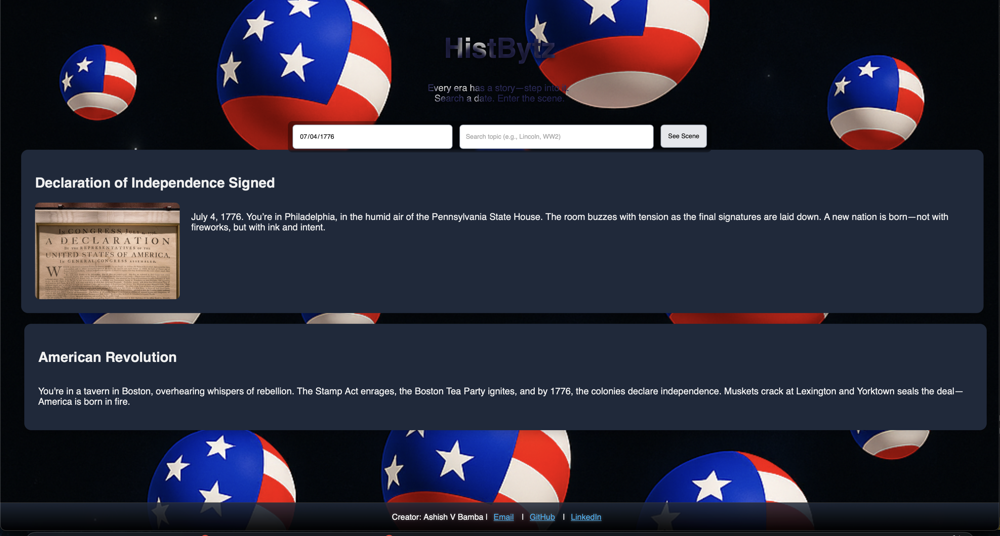

# 🕰️ HistBytz

**Interactive Timeline Explorer for U.S. History**

[](LICENSE)  
🔗 **Live App:** [HistBytz](https://histbytz-app.onrender.com)  

---

## 📌 Overview

**HistBytz** is a full-stack interactive history explorer built with React + Vite on the frontend and Node.js + Express on the backend. Users can search historical events by keyword or date, and the backend dynamically retrieves matching results from a JSON database.
- 🔤 **Keyword search**: e.g., "civil rights", "World War"
- 📅 **Date search**: e.g., "7/4/1776", "1960s"

The app maps your input to a **relevant historical period** and a **specific U.S. event**, providing clear, concise context.

---

## 🎯 Features

- 🧠 Intelligent, typo-tolerant search by word or date
- 📆 Mapped to both general historical era + specific event
- ⚡ Fast, lightweight UI with Vite + React
- 🗄️ Dynamic event retrieval from JSON via Express API
- 🧭 Educational for students, teachers, and trivia lovers

---

## ⚙️ Tech Stack

| Layer        | Technology         |
|--------------|--------------------|
| Frontend     | React + Vite       |
| Styling      | HTML/CSS           |
| Backend      | Node.js + Express  |
| Database     | JSON               |
| Dev Tools	   | ESLint, Babel / SWC|
---

## 🚀 How It Works

1. The app has **two search engines**:
   - One for **keywords**
   - One for **dates**
2. The search input is mapped to:
   - A **broad U.S. time period**
   - A **specific historical event**
3. The result includes:
   - Event name
   - Year
   - Brief description
   - Contextual notes

---

## 🧩 Vite + React Setup

This project uses [Vite](https://vitejs.dev/) for blazing-fast dev with HMR.

### 🔌 Plugins Used

- [`@vitejs/plugin-react`](https://github.com/vitejs/vite-plugin-react) (Babel-based)
- [`@vitejs/plugin-react-swc`](https://github.com/vitejs/vite-plugin-react-swc) (SWC-based)

Both support **Fast Refresh** during development.

---

## ✅ Linting & TypeScript Support

If you're using TypeScript:

- Use [typescript-eslint](https://github.com/typescript-eslint/typescript-eslint) for **type-aware linting**
- Template to get started: [React TS template](https://github.com/vitejs/vite/tree/main/packages/create-vite/template-react-ts)

---

## 🖥️ Screenshots

| Home Page | Search Result |
|-----------|----------------|
|  |  |

---

## 📦 Installation

```bash
# Clone repo
git clone https://github.com/AshishBamba05/histbytz-app.git
cd histbytz

# Install frontend dependencies
npm install

# Start frontend
npm run dev

# Install backend dependencies
cd server
npm install

# Start backend
npm start
